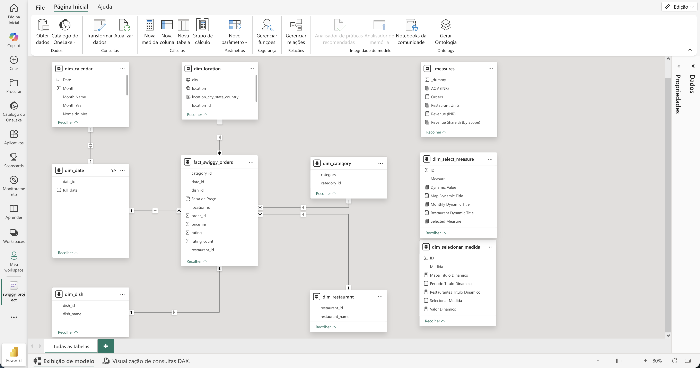
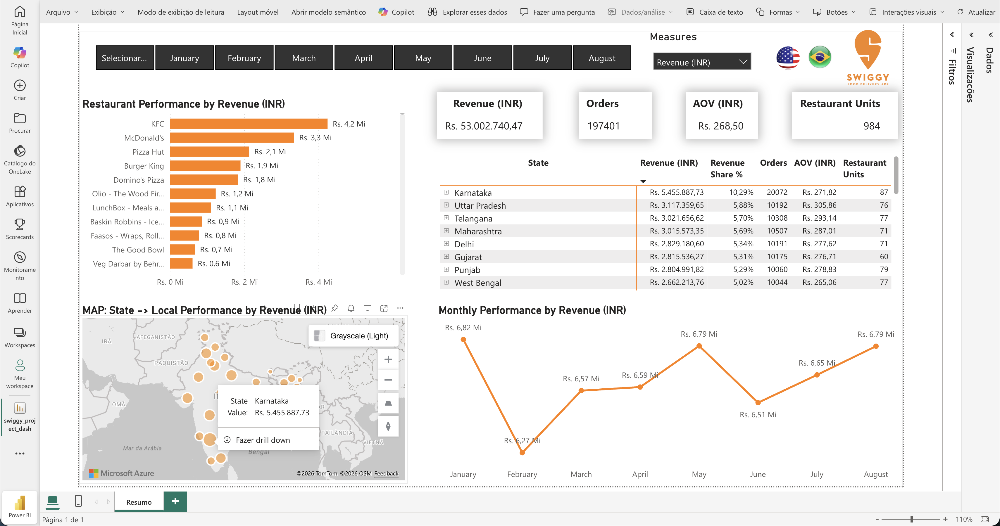
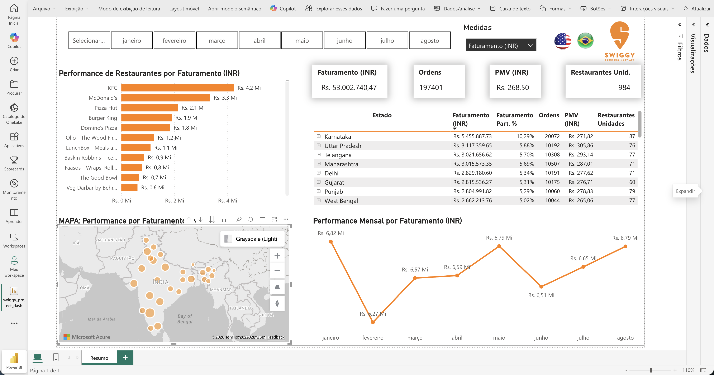

# Swiggy Delivery Analytics: End-to-End Data Pipeline

[](#)
[](#)
[](#)
[](#)
[](LICENSE)

Transformação de dados transacionais brutos da **Swiggy** (plataforma de delivery da Índia) em uma solução analítica estruturada com **Star Schema**, pronta para Business Intelligence e dashboards.

---

##  Índice

- [Arquitetura do Projeto](#arquitetura-do-projeto)
- [Estrutura do Repositório](#estrutura-do-repositório)
- [Pipeline de Dados](#pipeline-de-dados)
- [Modelagem Dimensional](#modelagem-dimensional)
- [Data Dictionary](#data-dictionary)
- [Insights de Negócio](#insights-de-negócio)
- [Dashboards](#dashboards)
- [Como Rodar](#como-rodar)
- [Tecnologias](#tecnologias)
- [Data Quality & Validações](#data-quality--validações)
- [Aprendizados & Observações](#aprendizados--observações)
- [Autor](#autor)

---

## Arquitetura do Projeto

```
┌─────────────────┐     ┌──────────────────┐     ┌──────────────────┐
│   Dados Brutos  │────▶│  Staging Layer   │────▶│  Cleaned Layer   │
│  (CSV / Excel)  │     │  (All VARCHAR)   │     │  (Typed Tables)  │
└─────────────────┘     └──────────────────┘     └────────┬─────────┘
                                                          │
                                                          ▼
┌─────────────────┐     ┌──────────────────┐     ┌──────────────────┐
│  KPIs / Queries │◀────│  Validation      │◀────│  Star Schema     │
│  (Dashboards)   │     │  (Integrity)     │     │  (Dim + Fact)    │
└─────────────────┘     └──────────────────┘     └──────────────────┘
```

---

## Estrutura do Repositório

```
.
├── assets/                          # Imagens e screenshots
│   ├── 01_star_schema_model.png     # Modelo dimensional
│   ├── 02_dax_logic_revenue_share.png
│   ├── 03_dashboard_main_en.png     # Dashboard em inglês
│   └── 04_dashboard_main_pt.png     # Dashboard em português
├── data/
│   ├── raw/                         # Dados brutos originais
│   │   ├── Swiggy_Data.csv
│   │   └── swiggy_data.xlsx
│   └── clean/                       # Dados processados e exportados
│       ├── dim_category_*.csv
│       ├── dim_date_*.csv
│       ├── dim_dish_*.csv
│       ├── dim_location_*.csv
│       ├── dim_restaurant_*.csv
│       └── fact_swiggy_orders_*.csv
├── docs/                            # Documentação adicional
├── scripts/
│   └── sql/                         # Scripts SQL do pipeline
│       └── swiggy_star_schema_pipeline.sql
├── .gitignore
└── README.md
```

---

## Pipeline de Dados

| Etapa | Descrição | Técnicas |
|-------|-----------|----------|
| **1. Ingestão** | Carregamento seguro dos dados brutos em staging | Todas as colunas como `VARCHAR` para evitar falhas de tipagem |
| **2. Limpeza** | Conversão defensiva e padronização de tipos | `TRY_CONVERT`, `COALESCE`, tratamento de datas em múltiplos formatos |
| **3. Qualidade** | Auditoria de nulos, strings vazias e duplicatas | Análise de nulls, `NULLIF(LTRIM(RTRIM()))`, `ROW_NUMBER()` |
| **4. Modelagem** | Construção do Star Schema (Dimensões + Fato) | `IDENTITY`, `UNIQUE constraints`, `FOREIGN KEYs` |
| **5. Validação** | Verificação de integridade referencial e consistência | Contagem de órfãos, comparação de volumes entre camadas |
| **6. Análise** | Consultas KPI e métricas de negócio | Agregações, `JOINs`, `CASE WHEN`, funções de data |

---

## Modelagem Dimensional

### Star Schema



### Tabelas de Dimensão

| Dimensão | Chave | Atributos |
|----------|-------|-----------|
| `dim_date` | `date_id` | full_date, year, month, month_name, quarter, day, week |
| `dim_location` | `location_id` | state, city, location |
| `dim_restaurant` | `restaurant_id` | restaurant_name |
| `dim_category` | `category_id` | category |
| `dim_dish` | `dish_id` | dish_name |

### Tabela Fato

| Fato | Chave | Métricas |
|------|-------|----------|
| `fact_swiggy_orders` | `order_id` | price_inr, rating, rating_count |

---

## Data Dictionary

### Dados Originais

| Coluna | Tipo Original | Tipo Final | Descrição |
|--------|---------------|------------|-----------|
| State | VARCHAR(150) | VARCHAR(150) | Estado na Índia |
| City | VARCHAR(150) | VARCHAR(150) | Cidade |
| Order Date | VARCHAR(50) | DATE | Data do pedido (formatos: dd-mm-yyyy / dd/mm/yyyy) |
| Restaurant Name | VARCHAR(300) | VARCHAR(300) | Nome do restaurante |
| Location | VARCHAR(300) | VARCHAR(300) | Bairro/localização específica |
| Category | VARCHAR(150) | VARCHAR(150) | Categoria do prato |
| Dish Name | VARCHAR(500) | VARCHAR(500) | Nome do prato |
| Price (INR) | VARCHAR(50) | DECIMAL(10,2) | Preço em Rúpias Indianas |
| Rating | VARCHAR(50) | DECIMAL(3,1) | Avaliação (0-5) |
| Rating Count | VARCHAR(50) | INT | Quantidade de avaliações |

---

## Insights de Negócio

| Métrica | Valor |
|---------|-------|
| Faturamento Total | ~Rs. 53 milhões |
| Volume de Pedidos | 197.000+ |
| Estado Dominante | Karnataka (>10% market share) |
| Top Restaurantes | KFC, McDonald's |

---

## Dashboards

### Dashboard Principal (Inglês)



### Dashboard Principal (Português)



---

## Como Rodar

### Pré-requisitos

- [Docker](https://www.docker.com/) (para SQL Server em ambiente ARM)
- [DBeaver](https://dbeaver.io/) ou outro cliente SQL
- SQL Server rodando em container

### Setup do SQL Server (MacBook M2 / ARM)

```bash
docker run -e "ACCEPT_EULA=Y" \
           -e "MSSQL_SA_PASSWORD=YourStrong@Passw0rd" \
           -p 1433:1433 \
           --name sqlserver \
           -d mcr.microsoft.com/azure-sql-edge
```

### Executando o Pipeline

1. Conecte ao SQL Server via DBeaver
2. Abra o script `scripts/sql/swiggy_star_schema_pipeline.sql`
3. Execute as seções **em ordem** (selecione cada bloco antes de executar)
4. Os dados brutos devem ser carregados manualmente na tabela `swiggy_orders_raw` antes da execução:

```sql
-- Exemplo de carga via BULK INSERT
BULK INSERT dbo.swiggy_orders_raw
FROM '/path/to/data/raw/Swiggy_Data.csv'
WITH (
    FIRSTROW = 2,
    FIELDTERMINATOR = ',',
    ROWTERMINATOR = '\n',
    TABLOCK
);
```

5. Após execução, consulte as tabelas `fact_swiggy_orders` e dimensões para análise

---

## Tecnologias

| Tecnologia | Uso |
|------------|-----|
| **SQL Server** | Banco de dados principal, ETL e modelagem |
| **Docker** | Containerização do SQL Server (compatibilidade ARM) |
| **DBeaver** | IDE e gerenciamento do banco de dados |
| **SQL** | ETL, limpeza, modelagem dimensional e análises |
| **Power BI** | Dashboards e visualizações (opcional) |

---

## Data Quality & Validações

O pipeline inclui verificações automáticas de qualidade:

- **Conversão defensiva**: `TRY_CONVERT` retorna `NULL` em vez de falhar
- **Análise de nulos**: Contagem de valores nulos por coluna após conversão
- **Strings vazias**: Detecção de campos vazios ou com espaços
- **Deduplicação**: Identificação e remoção de linhas duplicadas com `ROW_NUMBER()`
- **Integridade referencial**: Verificação de órfãos entre fato e dimensões
- **Consistência de volume**: Comparação de contagem entre tabela limpa e fato

---

## Aprendizados & Observações

### Limitação Identificada na Fonte

Durante a análise, identifiquei uma **limitação importante**: a ausência de padronização nos nomes dos pratos compromete a confiabilidade de métricas relacionadas a mix de produtos. Sem normalização prévia ou regras adicionais de negócio, análises de popularidade de pratos podem gerar interpretações imprecisas.

### Lições Aprendidas

- **Staging como texto** é uma estratégia defensiva valiosa para dados com inconsistências de formato
- **Constraints UNIQUE** nas dimensões previnem multiplicação de linhas em JOINs futuros
- **Validações de integridade** devem ser parte obrigatória de qualquer pipeline de dados

---

## Autor

**Luana Guimaraes**

[](https://www.linkedin.com/in/luaguimaraes)
[](https://github.com/luaguimaraes)

---

> **Nota**: Este projeto foi desenvolvido em um MacBook Air M2. O SQL Server foi executado via Docker (Azure SQL Edge) para contornar limitações de compatibilidade com arquitetura ARM.
